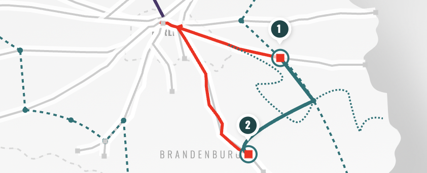

# Bahn & Bike (SPA)

## Description of the App

This program displays train lines from Berlin that allow carrying a bike and how they are connected to long distance cycling routes.
There are good apps for getting train connections and for planning and tracking cycling trips, but little to bring them together. This app is meant to bridge the gap and make it easier to plan a trip when you have to bring bike and train connections together.

## Techniques

### React and Redux

The Frontend Application is built with React using `npx create React App`. It uses the Redux store.

### Dynamic SVG rendering and animation

The trainline data includes the latitude and longitude position of each stop. These are converted to svg polylines and rendered with a css dasharray animation in an svg containing the map background.

#### Cycling Routes

If a cycling route is clicked, it is rendered as an svg path with beziers to the map. The beziers are calculated with a function in a custom hook that takes in the previous and the next stop position.

#### Clipping

The map clipping is calculated in a custom hook that takes in the longest trainline distance from the starting point.

## Features

+ Show all direct trains from Berlin within the chosen time 
+ Show all cycling routes that cross the chosen train line
+ Show available train stations along a chosen cycling route when a leg of the cycling route was clicked
+ Show possible cycling route combinations when a leg of the cycling route was clicked

## To Dos

+ Add interactive functionality like activation of more than one veloroute section
+ Improve performance by rendering trainlines from queues rather than arrays
+ Optimize for mobile devices
+ Add data for other cities
+ Add train connections that include a change

## Change Log

#### 2022-02-10

+ Add combined veloroute feature 
When a leg of a chosen cycling path is clicked, possible cycling route combinations are shown, if any exist. If clicked, alternative train stations as start and end point of the trip are listed.

# Live Site
https://bahn-und-bike.eu